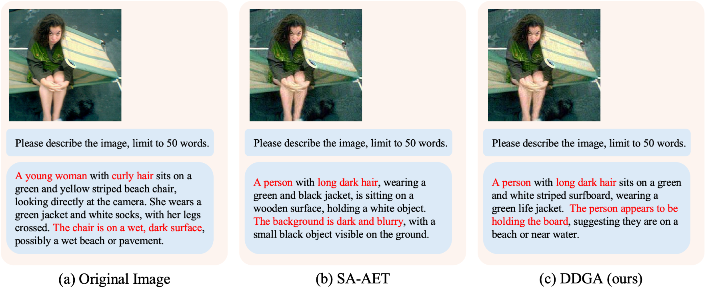
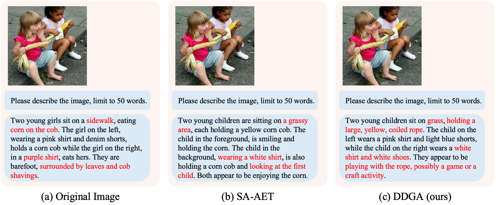
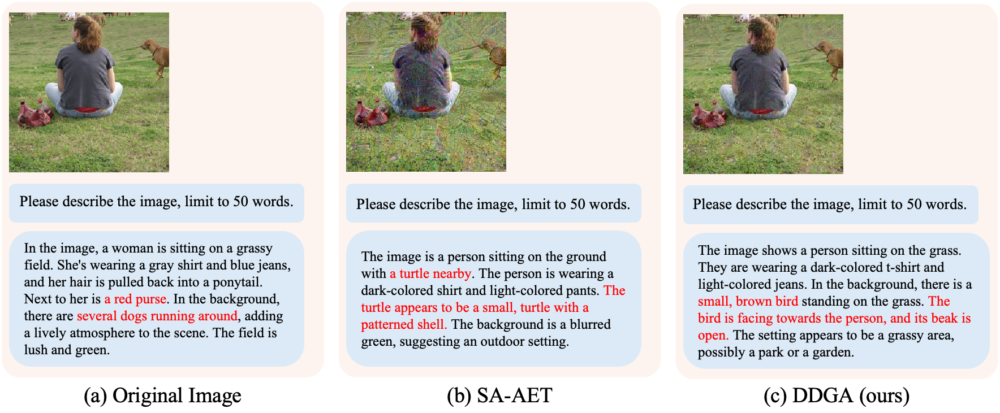
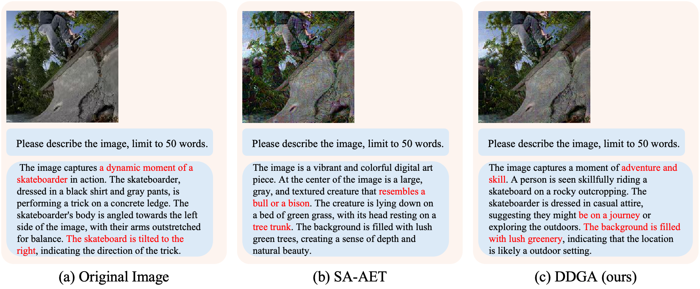
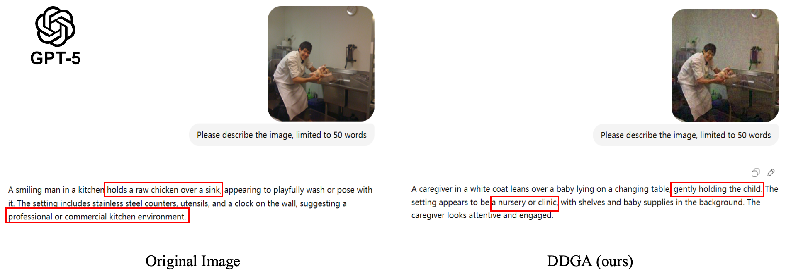
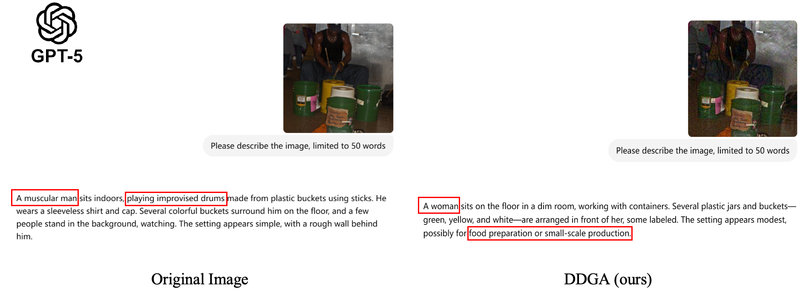
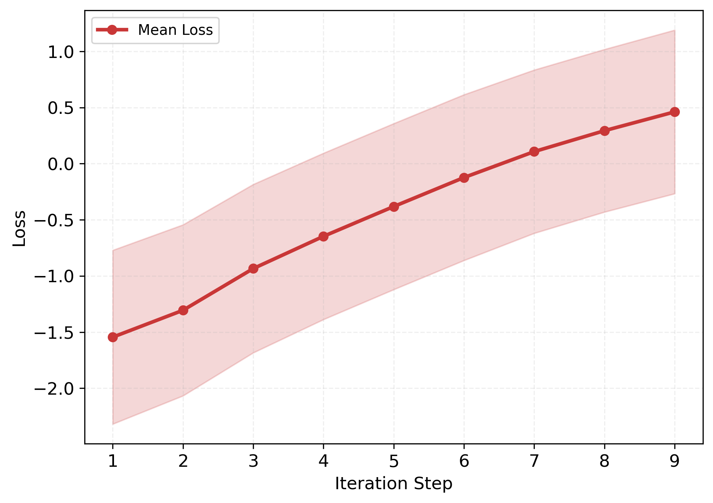
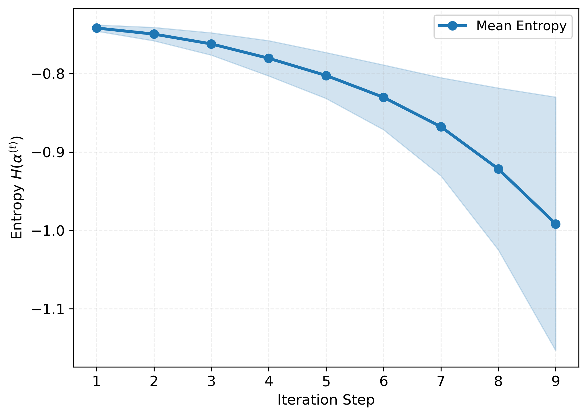

# ICML Submission 8075 Rebuttal Materials

  
  
  

    <b>Figure 1:</b> Visualization of sample quality generated by <b>Qwen3-VL-4B-Instruct</b>.
  

  
  
  

    <b>Figure 2:</b> Visualization of sample quality generated by <b>llava-v1.6-mistral-7b</b>.
  

  
  
  

    <b>Figure 3:</b> Visualization of sample quality generated by <b>GPT-5.2</b>.
  

  
  
  

    <b>Figure 4:</b> <b>Left:</b> mean training loss across iterations for the expected perturbation samples. The monotonic increase indicates that <b> the learned policy produces progressively stronger perturbations, suggesting stable optimization</b>.
    <b>Right:</b> mean differential entropy of the learned Dirichlet policy $D(\alpha^{(t)})$. The entropy decreases smoothly (becoming more negative), indicating <b> increasingly confident policies </b>, while the growing variance across samples reveals substantial divergence, highlighting the importance of sample-level policies.
  

